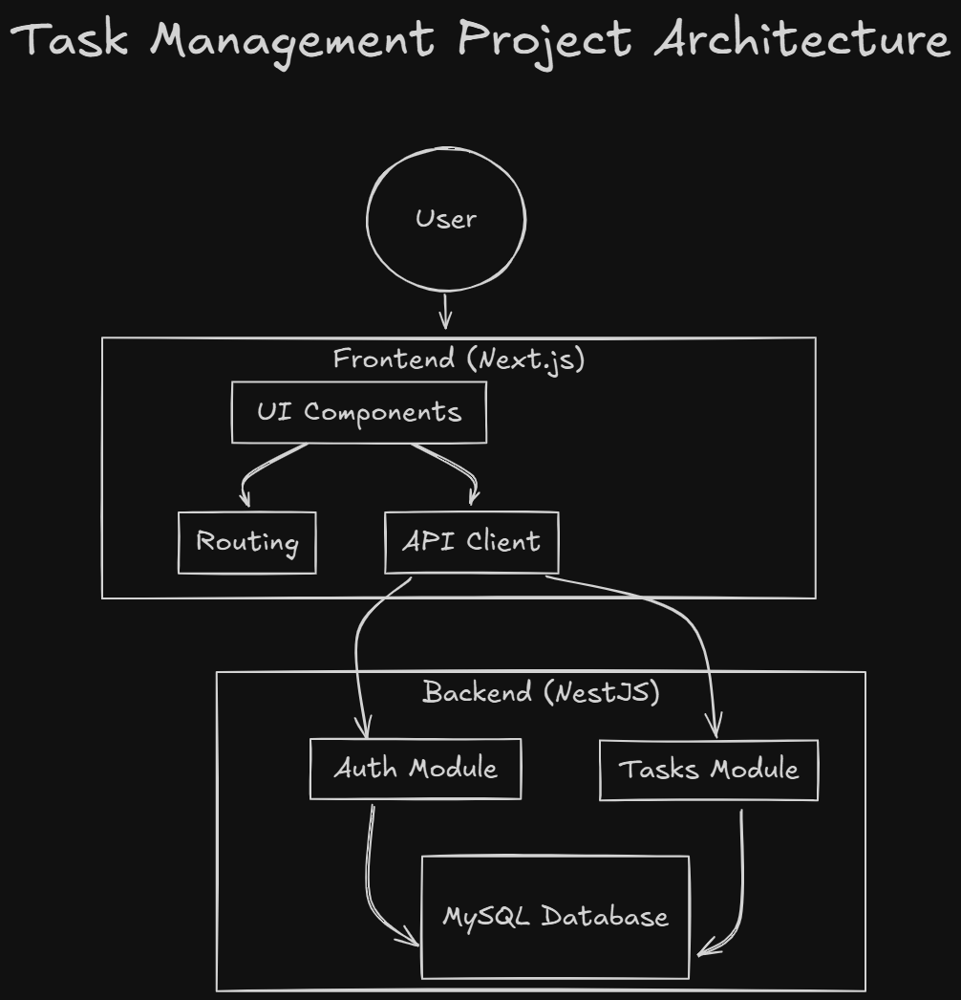

# Task Manager Application

A full-stack task management application built with NestJS, Next.js, MySQL, and TypeScript.

## Table of Contents

- [Task Manager Application](#task-manager-application)
  - [Table of Contents](#table-of-contents)
  - [Prerequisites](#prerequisites)
  - [Project Structure](#project-structure)
  - [Architecture](#architecture)
  - [Backend Setup](#backend-setup)
  - [Frontend Setup](#frontend-setup)
  - [Running the Project](#running-the-project)
  - [API Endpoints](#api-endpoints)
    - [Authentication](#authentication)
    - [Tasks](#tasks)
    - [Query Parameters](#query-parameters)
  - [Features](#features)
  - [Technologies Used](#technologies-used)
    - [Backend](#backend)
    - [Frontend](#frontend)
  - [Technical Explanation](#technical-explanation)
  - [Agradecimiento y Disculpa](#agradecimiento-y-disculpa)

## Prerequisites

Make sure you have the following installed:

- Node.js (v16 or higher)
- MySQL (v8.0 or higher)
- npm or yarn
- Git

## Project Structure

```
TaskManager/
├── backend/                 # NestJS Project
│   ├── src/
│   │   ├── auth/            # Authentication Module
│   │   │   ├── dto/         # Data Transfer Objects
│   │   │   │   ├── create-user.dto.ts
│   │   │   │   └── login.dto.ts
│   │   │   ├── entities/    # Authentication Entities
│   │   │   │   └── user.entity.ts
│   │   │   ├── types/       # Types for Authentication
│   │   │   │   └── auth.types.ts
│   │   │   ├── auth.controller.ts
│   │   │   ├── auth.module.ts
│   │   │   ├── auth.service.ts
│   │   │   ├── get-user.decorator.ts
│   │   │   ├── jwt-auth.guard.ts
│   │   │   └── jwt.strategy.ts
│   │   ├── tasks/           # Tasks Module
│   │   │   ├── dto/         # Data Transfer Objects
│   │   │   ├── entities/    # Task Entities
│   │   │   ├── tasks.controller.ts
│   │   │   ├── tasks.module.ts
│   │   │   └── tasks.service.ts
│   │   ├── types/           # Global Types
│   │   │   └── task.types.ts
│   │   ├── app.controller.ts
│   │   ├── app.module.ts
│   │   ├── app.service.ts
│   │   └── main.ts
│   ├── .env                 # Environment Variables
│   ├── package.json
│   ├── .eslintrc.js         # ESLint Configuration
│   ├── .gitignore           # Git Ignore
│   ├── .prettierrc          # Prettier Configuration
│   ├── nest-cli.json        # Nest CLI Configuration
│   ├── package-lock.json
│   └── tsconfig.json        # TypeScript Configuration
│   └── tsconfig.json
└── frontend/               # Next.js Project
    ├── src/
    │   ├── app/            # Next.js Pages
    │   │   ├── auth/       # Authentication Pages
    │   │   └── tasks/      # Task Management Pages
    │   ├── components/     # React Components
    │   │   ├── ui/         # UI Components
    │   │   │   ├── LoginForm.tsx
    │   │   │   ├── Navbar.tsx
    │   │   │   ├── RegisterForm.tsx
    │   │   │   ├── TaskForm.tsx
    │   │   │   ├── TaskList.tsx
    │   │   │   └── withAuth.tsx
    │   ├── context/        # Authentication Contexts and Others
    │   │   └── AuthContext.tsx
    │   ├── lib/            # Utilities and Configuration
    │   │   └── api.ts
    │   ├── providers/      # Context Providers
    │   │   └── ClientProvider.tsx
    │   ├── types/          # TypeScript Definitions
    │   │   ├── auth.ts
    │   │   └── task.ts
    │   ├── styles/         # CSS Files and Global Styles
    │   │   ├── globals.css
    │   │   └── layout.tsx
    ├── .env.local
    ├── package.json
    ├── favicon.ico
    └── tsconfig.json
```

## Architecture

This shows a representation of the overall architecture of the application, highlighting the communication between the frontend (Next.js) and the backend (NestJS), as well as the MySQL database.



## Backend Setup

1. Clone the repository and navigate to the backend directory:

   ```bash
   git clone [REPOSITORY_URL]
   cd task-management/backend
   ```

2. Install dependencies:

   ```bash
   npm install
   ```

3. Create a `.env` file at the root of the backend:

   ```env
   # Database
   DB_HOST=localhost
   DB_PORT=3306
   DB_USERNAME=your_username
   DB_PASSWORD=your_password
   DB_NAME=task_management

   # JWT
   JWT_SECRET=your_secret_key

   # Environment
   NODE_ENV=development
   PORT=8080

   # CORS
   CORS_ORIGIN=http://localhost:3000
   ```

4. Set up the MySQL database:

   ```sql
   CREATE DATABASE task_management;
   ```

5. Instala las dependencias necesarias:

```bash
npm install @nestjs/jwt @nestjs/passport passport passport-jwt bcrypt
npm install --save-dev @types/passport-jwt @types/bcrypt
npm install @nestjs/mapped-types
```

## Frontend Setup

1. Navigate to the frontend directory:

   ```bash
   cd ../frontend
   ```

2. Install dependencies:

   ```bash
   npm install
   ```

3. Create a `.env.local` file:

   ```env
   NEXT_PUBLIC_API_URL=http://localhost:8080
   ```

4. Install UI dependencies:

   ```bash
   npm install @radix-ui/react-dialog @radix-ui/react-select
   npm install lucide-react
   ```

## Running the Project

1. Start the backend (from the backend directory):

   ```bash
   # Development mode
   npm run start:dev

   # Production mode
   npm run build
   npm run start:prod
   ```

2. Start the frontend (from the frontend directory):

   ```bash
   # Development mode
   npm run dev

   # Production mode
   npm run build
   npm start
   ```

The application will be available at:

- Frontend: http://localhost:3000
- Backend API: http://localhost:8000/

## API Endpoints

### Authentication

```
POST /auth/register - User registration
POST /auth/login    - Login
```

### Tasks

```
GET    /tasks       - Get all tasks
GET    /tasks/:id   - Get a specific task
POST   /tasks       - Create a new task
PUT    /tasks/:id   - Update a task
DELETE /tasks/:id   - Delete a task
```

### Query Parameters

- `status`: Filter tasks by status (pending/in_progress/completed)

## Features

- 🔐 JWT Authentication
- 📝 Full CRUD for tasks
- 🎨 Modern user interface
- 📱 Responsive design
- 🔍 Task filtering
- 📅 Due date management
- ⚡ Data validation on frontend and backend
- 🔒 Route protection
- 🌐 RESTful API

## Technologies Used

### Backend

- NestJS
- TypeScript
- MySQL
- TypeORM
- Passport JWT
- Class Validator

### Frontend

- Next.js 13+
- TypeScript
- Tailwind CSS
- shadcn/ui
- Axios
- React Hook Form
- Lucide Icons

## Technical Explanation

In developing the task management application, several key decisions were made to maximize functionality, security, and efficiency:

1. **NestJS for the Backend**: We opted for NestJS in the backend due to its modular architecture and compatibility with TypeScript. This makes it easy to organize code into independent modules (such as authentication and tasks), improving maintainability and allowing for future scaling of the application.

2. **Next.js for the Frontend**: We chose Next.js for the frontend as it enables optimized page generation, as well as protected routes and server-side rendering, enhancing both performance and security. The application ensures a fast and smooth user experience, especially in loading tasks and authentication.

3. **JWT Authentication**: Authentication using JWT allows users to log in once and then make requests to protected endpoints securely. This approach reduces server load by eliminating the need to manage sessions and fits well with a REST API architecture.

4. **Validation on Both Sides**: We implemented data validation on both the frontend (using controlled forms) and the backend (using DTOs and Class Validator). This ensures that only valid data is processed and stored, reducing the chance of errors and improving the user experience.

5. **MySQL and TypeORM**: We chose MySQL for data storage due to its reliability and support for complex queries. TypeORM was used in the backend to interact with the database, allowing for easy and efficient definition of entities and relationships.

## Agradecimiento y Disculpa

Antes que nada, quiero expresar mi agradecimiento por el tiempo brindado para completar y enviar esta prueba técnica. Realicé un esfuerzo considerable para cumplir con los requerimientos, y había logrado finalizar la implementación incluso antes del plazo previsto.

Sin embargo, al intentar aplicar una metodología de trabajo más estructurada con Git Flow para organizar mejor el proyecto, tuve algunos conflictos inesperados en el manejo de ramas, lo que resultó en una serie de problemas que me llevaron a tener que subir el proyecto nuevamente. Esto causó que, en los commits iniciales, se viera el frontend terminado, mientras que el backend se encontraba vacío.

Una vez identificado el problema, dediqué tiempo adicional para reconstruir el backend desde cero, asegurándome de que funcionara correctamente con el frontend que ya estaba terminado. Reconozco que este proceso retrasó la entrega y lamento profundamente cualquier inconveniente que esto haya podido causar. Aprecio su comprensión ante la situación y, nuevamente, agradezco la oportunidad para completar y enviar la prueba en su totalidad.
